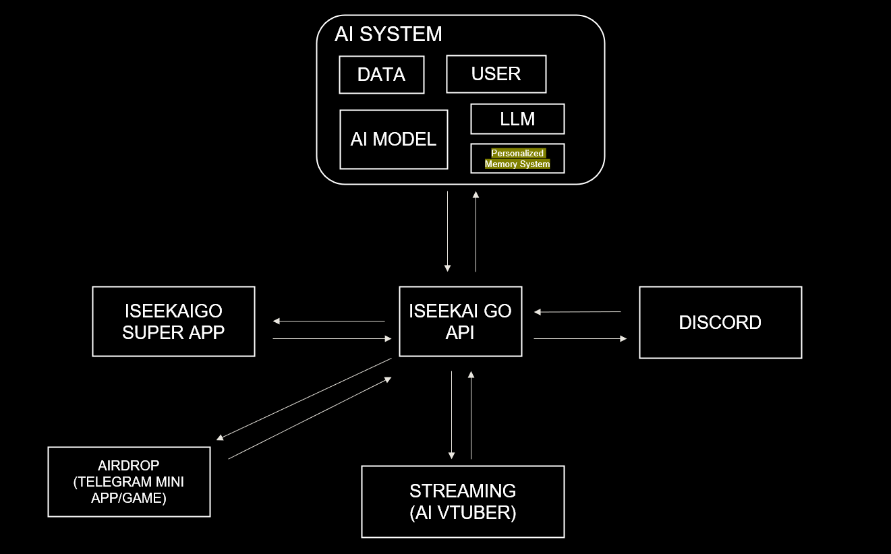

# violetai_notes

VioletAI is the first-ever AI-powered GameFi character and AI VTuber from the ISEEKAIGO Project—an interactive, token-enabled persona that connects gaming, AI agents, AR, and web3 innovation.

The Violet AI token ($VioletAI) is a fan-driven cryptocurrency inspired by Violet AI, the flagship UR (ultra rare) NFT AI character of the Iseekaigo universe. As a core utility token, $VioletAI unlocks exclusive opportunities for holders, including the ability for the top 20 holders to redeem Violet NFTs upon Iseekaigo's mainnet launch. When the Iseekaigo project is fully released, $VioletAI will power in-app and in-game transactions such as purchases, trading, gacha mechanics, staking, and more, solidifying its place at the heart of the ecosystem.

Dexscreener: https://dexscreener.com/solana/g5qky4w9qevqre5ao4ymjjdebdcx8qvvjrdzifh1gzbh

## AI Architecture

Have you ever imagined having a 1:1 conversation with your favorite VTuber who remembers you like a real friend?

We’re excited to announce that our AI system will soon be live!
Vio will remember your past chats and interactions, just like human memory, making every conversation feel uniquely personal and engaging. Whether in ISEEKAIGO Game, Discord, during live streams, she’ll always recognize you.

🚀 This feature will be exclusive to UR and LR characters from the ISEEKAIGO universe, starting with 💜 VioletAI 💜

Get ready for this exciting update!

## LINKS

- VioletAI Telegram Channel: https://t.me/violetai_iseekaigo
- VioletAI Telegram Group Chat: https://t.me/violetai_iseekaigo_hub
- VioletAI Twitter: https://x.com/VioletAi_chan
- VioletAI Gecko Terminal: https://www.geckoterminal.com/solana/pools/G5qKy4W9qevqRe5ao4YMJJDEBDcX8QvvJrDziFH1gZbH
- VioletAi Website: https://violetai.iseekaigo.com/

- ISEEKAIGO Discord: https://discord.gg/hpmEhtCbRY
- ISEEKAIGO Twitter: https://x.com/ISEEKAI_GO
- ISEEKAIGO Website: https://www.iseekaigo.com/

## Github

This repository is dedicated to gathering suggestions and constructive feedback from the community. We value your input and will review all submissions thoroughly. Relevant issues, suggestions, and critiques will be forwarded to our development team for consideration and resolution.

Our goal is to foster an open dialogue with the community, ensuring that your voices help shape the future of this project. Whether it's feature requests, bug reports, or general feedback, we are here to listen and collaborate.
